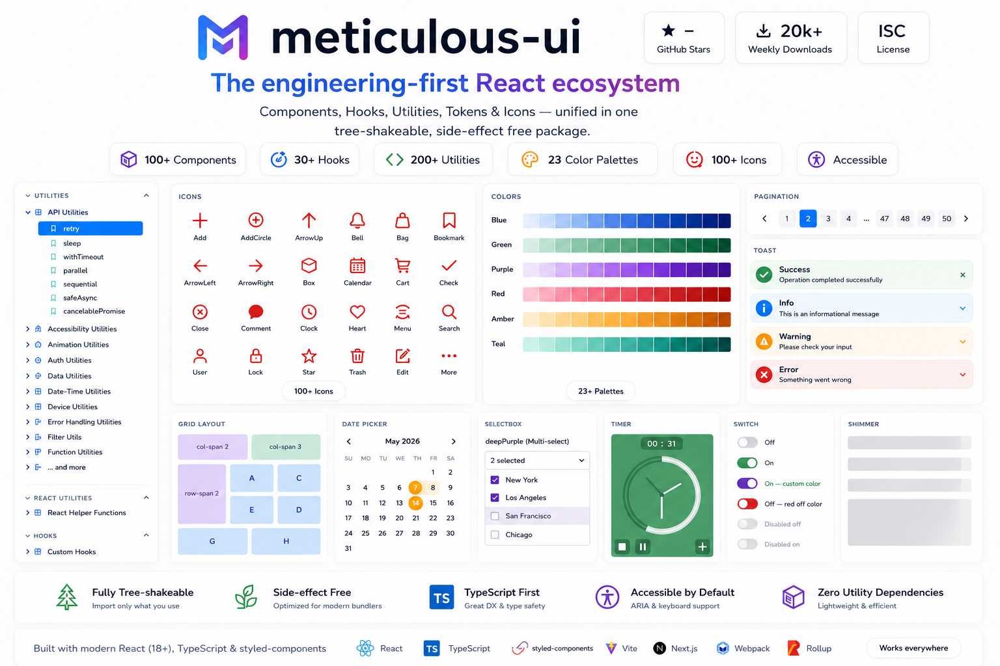

# meticulous-ui

[](https://www.npmjs.com/package/meticulous-ui)
[](https://www.npmjs.com/package/meticulous-ui)
[](https://www.npmjs.com/package/meticulous-ui)

<a href="https://meticulous-ui.vercel.app/" target="_blank" rel="noopener noreferrer"></a>

<p align="center">
  <a href="https://meticulous-ui.vercel.app/">Documentation</a> •
  <a href="https://bundlephobia.com/package/meticulous-ui">Bundle Size</a> •
  <a href="https://github.com/xe3110/meticulous-ui">GitHub</a>
</p>

An engineering-first React ecosystem — components, hooks, utilities, tokens, and icons unified in a single tree-shakeable package.  
Built for scalable, production-grade applications.

⚡ Fully tree-shakeable  
🪶 Side-effect free  
🎯 TypeScript-first  
♿ Accessible by default  
💅 styled-components

---

## Why meticulous-ui?

Modern frontends rely on fragmented ecosystems:

- 🧩 One package for components
- 🪝 Another for hooks
- 🔧 Another for utilities
- 🎨 Another for icons
- 🎯 Another for tokens

This leads to:

- 📦 Dependency bloat
- ⚠️ Inconsistent APIs
- 🏋️ Larger bundles
- 🔧 Growing maintenance overhead

meticulous-ui consolidates all of it into **one install** while staying fully tree-shakeable — you only pay for what you import.

### Why not multiple packages?

Most frontend ecosystems force developers to combine disconnected packages — each with its own API conventions, versioning, peer dependency conflicts, and documentation. The result is a fragmented developer experience that compounds over time.

meticulous-ui treats components, hooks, utilities, tokens, and foundations as a **single cohesive system** — designed together, versioned together, and documented together. One mental model. One import. One upgrade.

### Best suited for

- Enterprise dashboards and internal tools
- Design system foundations
- Frontend platform teams
- TypeScript-heavy projects
- Performance-sensitive applications

---

## Installation

```bash
npm install meticulous-ui
# or
yarn add meticulous-ui
```

### Peer dependencies

```bash
npm install react@^18 react-dom@^18 styled-components@^6
```

---

## Quick Start

```tsx
import { Button, Input, Toast, Shimmer, useLocalStorage, validateEmail } from 'meticulous-ui';
import blue from 'meticulous-ui/colors/blue';

function App() {
  const [email, setEmail] = useLocalStorage<string>('email', '');

  const handleSubmit = () => {
    if (!validateEmail(email)) {
      Toast.error('Invalid email');
      return;
    }
    Toast.success('Submitted successfully');
  };

  return (
    <>
      <Shimmer width={200} height={20} />
      <Input label='Email' color='blue' value={email} onChange={(e) => setEmail(e.target.value)} />
      <Button theme={blue} onClick={handleSubmit}>
        Submit
      </Button>
    </>
  );
}
```

For minimal bundle size, import directly from component paths:

```ts
import Button from 'meticulous-ui/components/Button';
import blue from 'meticulous-ui/colors/blue';
```

meticulous-ui is fully tree-shakeable and side-effect free — optimized for Vite, Webpack, Rollup, and Next.js.

---

## Documentation & Storybook

Full interactive docs: [https://meticulous-ui.vercel.app/](https://meticulous-ui.vercel.app/)

- Colors → [Tokens: Colors](https://meticulous-ui.vercel.app/?path=/story/tokens-colors--default)
- Icons → [Tokens: Icons](https://meticulous-ui.vercel.app/?path=/story/tokens-icons--default)
- Hooks → [Custom Hooks](https://meticulous-ui.vercel.app/?path=/story/hooks-custom-hooks)
- Utilities → [Engineering Utilities](https://meticulous-ui.vercel.app/?path=/story/utilities-api-utilities--retry)
- React helpers → [React Utilities](https://meticulous-ui.vercel.app/?path=/story/react-utilities-react-helper-functions)

---

## Ecosystem Architecture

meticulous-ui is organized into layered abstractions. Higher layers build on lower ones; you can use any layer independently.

```
┌─────────────────────────────────────────────────┐
│                   Organisms                     │  Complex production-ready UI systems
│         Toast · Pagination · VideoPlayer        │
├─────────────────────────────────────────────────┤
│                   Molecules                     │  Composed interactive components
│      Dropdown · DatePicker · OtpInput           │
├─────────────────────────────────────────────────┤
│                    Atoms                        │  Basic UI building blocks
│       Button · Input · Checkbox · Switch        │
├─────────────────────────────────────────────────┤
│                  Foundations                    │  Layout & application primitives
│              Grid · RootComponent               │
├──────────────────┬──────────────────────────────┤
│      Hooks       │       Utilities              │  Reusable logic, framework-agnostic
│  useLocalStorage │  validateEmail · formatDate  │
├──────────────────┴──────────────────────────────┤
│                   Tokens                        │  Design primitives
│       23 color palettes · 100+ SVG icons        │
└─────────────────────────────────────────────────┘
```

---

## Components

### Core UI

Button · Input · Textarea · Checkbox · RadioGroup · Dropdown · Selectbox · Switch · Link

### Feedback & Loading

Toast · ToastContainer · Spinner · Loader · PageLoader · Shimmer

### Overlays & Navigation

Modal · Pagination · Carousel

### Forms & Productivity

OtpInput · FileUploader · DatePicker

### Media

Image · VideoPlayer

### Typography

H1–H6 · P

### Utility

Timer · RootComponent

---

## Tokens

### Colors

23 production-ready palettes (blue, red, green, amber, grey, cider, and more) with multiple shades each.  
→ [Explore colors](https://meticulous-ui.vercel.app/?path=/story/tokens-colors--default)

### Icons

100+ modern SVG icons across categories: arrows, commerce, social, media, security, UI controls.  
→ [Explore icons](https://meticulous-ui.vercel.app/?path=/story/tokens-icons--default)

---

## Hooks

Custom hooks organized by purpose:

| Category    | Examples                               |
| ----------- | -------------------------------------- |
| State       | `useToggle`, `useCounter`              |
| Lifecycle   | `useMountEffect`, `usePrevious`        |
| Storage     | `useLocalStorage`, `useSessionStorage` |
| DOM/Browser | `useMediaQuery`, `useClickOutside`     |
| Utility     | `useDebounce`, `useThrottle`           |

---

## Engineering Utilities

Production-focused utility functions organized by domain:

| Category       | Examples                       |
| -------------- | ------------------------------ |
| Validation     | `validateEmail`, `validateUrl` |
| String         | `truncate`, `slugify`          |
| Number         | `clamp`, `formatCurrency`      |
| Date-time      | `formatDate`, `timeAgo`        |
| API            | `retry`, `debounceAsync`       |
| Auth           | token helpers                  |
| Feature flags  | `isFeatureEnabled`             |
| Accessibility  | `getFocusableElements`         |
| Performance    | `memoize`, `measureTime`       |
| Error handling | `tryCatch`, `safeJSON`         |
| Storage        | `safeGet`, `safeSet`           |

---

## React Utilities

Helper functions for scalable React patterns:

- `lazyImport` — code-split any module with a consistent API
- `composeProviders` — flatten deeply nested providers
- `withSuspense` — wrap any component with a Suspense boundary
- `memoCompare` — custom comparator for `React.memo`

---

## Performance

meticulous-ui is built to have zero performance cost at the bundler level.

- ⚡ **Fully tree-shakeable** — unused code is eliminated at build time
- 🪶 **Side-effect free** — safe for aggressive dead code elimination
- 📦 **Import only what you use** — one component, one hook, or the whole library
- 🔀 **ESM + CJS** — works with every modern bundler and runtime
- 🚀 **Optimized for Vite, Webpack, Rollup, and Next.js** — no config needed

```ts
// pays for Button only — nothing else ships
import Button from 'meticulous-ui/components/Button';

// or use named imports — tree-shaking handles the rest
import { Button, useLocalStorage } from 'meticulous-ui';
```

Bundle size: [bundlephobia.com/package/meticulous-ui](https://bundlephobia.com/package/meticulous-ui)

---

## Philosophy

- **Minimal dependencies** — no opinion on state management or routing
- **Consistent developer experience** — predictable APIs across all layers
- **Accessibility by default** — ARIA + semantic HTML throughout
- **Performance-first** — tree-shakeable, side-effect free, zero external CSS
- **Scalable architecture** — layered design you can adopt incrementally

---

## Development Setup

```bash
npm install      # install dependencies
npm run dev      # start Storybook dev server
npm run build    # build the library
```

---

## Contributing

Contributions, bug reports, and feature requests are welcome.

**Adding a component**

1. Create the component under `src/components/<ComponentName>/`
2. Export it from the component's `index.ts` and from the root `src/index.ts`
3. Add a Storybook story under `src/stories/`
4. Use color tokens from `src/colors/` — never hardcode hex values

**Adding a hook or utility**

1. Add the function to the appropriate file under `src/hooks/` or `src/utils/`
2. Export it from the root `src/index.ts`
3. Add a Storybook story or docs entry if it has non-obvious usage

**General guidelines**

- All public APIs must be typed — no `any`
- Stories act as documentation; write them for the consumer, not the implementer
- Open an issue or discussion first for significant changes

---

## Changelog

See [CHANGELOG.md](./CHANGELOG.md) for release history and migration guides between major versions.

---

## License

ISC
